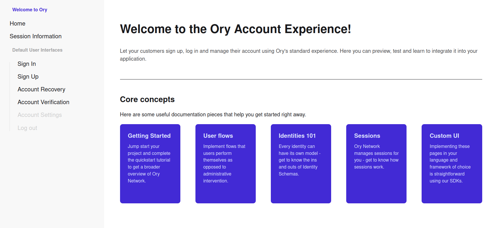

# Kratos Selfservice WASM



An SPA recreation of [kratos-selfservice-ui-node](https://github.com/ory/kratos-selfservice-ui-node) using [Dioxus](https://dioxuslabs.com/), [tailwindcss](https://tailwindcss.com/), and [daisyUI](https://daisyui.com/).

All runtime code is compiled to WASM using [a fork](https://github.com/justins-engineering/kratos-client-rust) of the [kratos-client-rust](https://github.com/ory/kratos-client-rust) that allows the use of the native [Fetch API](https://developer.mozilla.org/en-US/docs/Web/API/Fetch_API).

Local user state is managed with a combination of Dioxus state (similar to React) and a custom `session_expiry` cookie for persistence.

## Docker

### Build

Run the following command in the root of the project:
```bash
docker build -t kratos-selfservice-rust:latest .
```

### Run

```bash
docker run --rm --init -p 4455:4455 kratos-selfservice-rust:latest
```

## Docker Compose

1. Download or copy the [Docker Compose example file](docker-compose.yml)
2. Run `docker-compose up --force-recreate`
3. Open the web app at http://127.0.0.1:4455
4. Open MailSlurper at http://127.0.0.1:4436 to test email verification

## Development

### Requirements
- [Bun](https://bun.com/get)
- [Dioxus CLI](https://dioxuslabs.com/learn/0.6/getting_started/)
- [Docker Compose](https://docs.docker.com/compose/install/)

### Tailwind CSS
1. Run the following command in the root of the project:
```bash
bun install
```
2. Run the following command in the root of the project to start the Tailwind CSS compiler:

```bash
bunx @tailwindcss/cli -i ./tailwind.css -o ./assets/tailwind.css --watch
```

### Starting Kratos

Run the following command in the root of your project:

```bash
docker-compose -f docker-compose.dev.yml up --force-recreate
```

### Serving The App

Run the following command in the root of your project to start developing with the default platform:

```bash
dx serve --addr 127.0.0.1 --port 4455
```

- Open the web app at http://127.0.0.1:4455
- Open MailSlurper at http://127.0.0.1:4436
- Open [kratos-admin-ui](https://github.com/dhia-gharsallaoui/kratos-admin-ui) at http://127.0.0.1:3000
